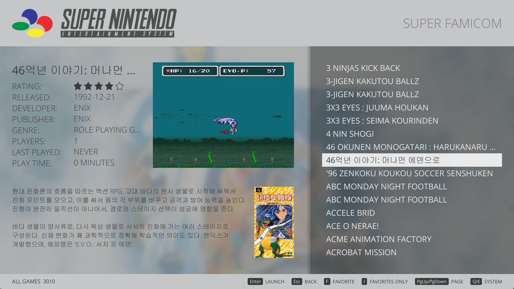

# ES2 Simple Plus theme for Pegasus

An extended version of [ES2 Simple](https://github.com/mmatyas/pegasus-theme-es2-simple) by Mátyás Mustoha,
the port of the *Simple* theme of EmulationStation to the [Pegasus](http://pegasus-frontend.org) frontend,
originally created by *Nils Bonenberger* <nilsbyte@nilsbyte.de>.

## Changes from ES2 Simple

- **Game videos**: the selected game's video plays automatically in a box sized
  to the system's screen ratio (screenshot shown until the video starts).
- **New layout and design**: game name, details and an auto-scrolling description
  on the left, video and boxart on the right; translucent game list panel,
  blurred game art background, button hints at the bottom.
- **Favorites**: toggle a game's favorite flag, show only the favorites of a
  system (systems with favorites open in this mode).
- **Console photos**: a carousel of console photos moves together with the
  system logos; logos added for systems that had none.
- **System selection**: choose which systems are shown from a settings menu
  on the system screen.
- Page up/down jumps one screen in the game list; button hints follow the
  last used input (gamepad or keyboard); the last position is restored.

## Controls

| Gamepad | Keyboard | System screen | Game list |
|---|---|---|---|
| A | Enter | Open system | Launch game |
| B | Esc | | Back |
| X | I | Systems menu | Favorites only / all games |
| Y | F | | Toggle favorite |
| L1 / R1 | Q / E | Previous / next system | Previous / next system |
| L2 / R2 | PgUp / PgDn | | Page up / down |

The keys follow the Pegasus key settings.

## Installation

[Download](https://github.com/wannabro/pegasus-theme-es2-simple/archive/master.zip) and extract to your
[theme directory](http://pegasus-frontend.org/docs/user-guide/installing-themes). You can then select
the theme in the settings menu of Pegasus.

## License

The theme is licensed under [CC BY-NC-SA 4.0](LICENSE), like the original.
The console photos have their own sources and licenses, see [devices/CREDITS.md](devices/CREDITS.md).
System logos are trademarks of their respective owners.
